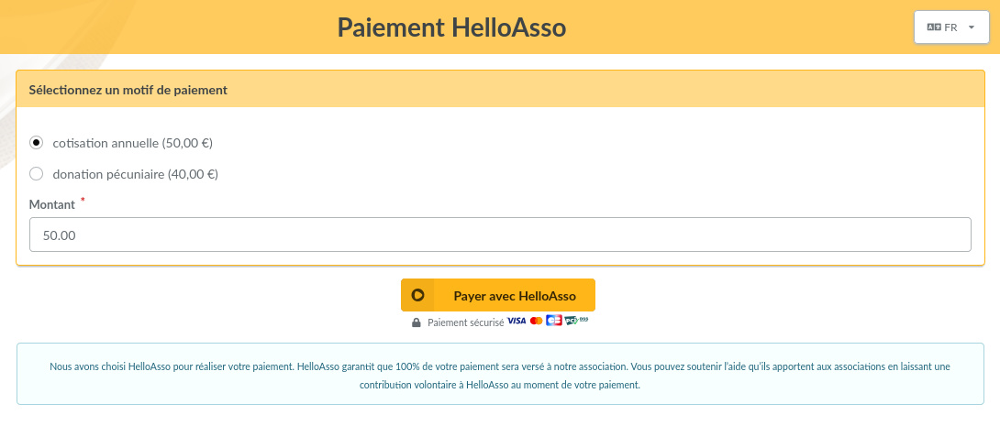

Ce plugin offre :

* un formulaire de paiement en ligne,
* un historique des paiements,
* la création automatique de contributions une fois les paiements validés.

> [!NOTE]
> Ce plugin nécessite la **version 1.2.0 de Galette minimum**.



> [!IMPORTANT]
> Pour fonctionner, ce plugin nécessite que votre instance de Galette soit accessible publiquement et servie avec un certificat SSL valide.

## Installation

Tout d’abord, téléchargez le plugin :

[](https://github.com/galette-community/plugin-helloasso/releases)

Décompressez l'archive téléchargée dans le répertoire `plugins` de Galette. Par exemple, sous linux (en remplaçant *{url}* et *{version}* par les valeurs correspondantes):

```
$ cd /var/www/html/galette/plugins
$ wget {url}
$ tar xjvf galette-plugin-helloasso-{version}.tar.bz2
```

## Initialisation de la base de données

Pour fonctionner, ce plugin nécessite plusieurs tables dans la base de données. Voir [l'interface de gestion des plugins de Galette](https://doc.galette.eu/fr/master/plugins/#plugins-management-interface).

Et voilà, le plugin *HelloAsso* est installé. :)

## Utilisation du plugin

Une fois le plugin installé, un groupe *Helloasso* est ajouté au menu de Galette lorsqu'un utilisateur est connecté, permettant aux administrateurs et aux membres du personnel de définir les paramètres du plugin et de consulter l'historique des paiements.


### Préférences


