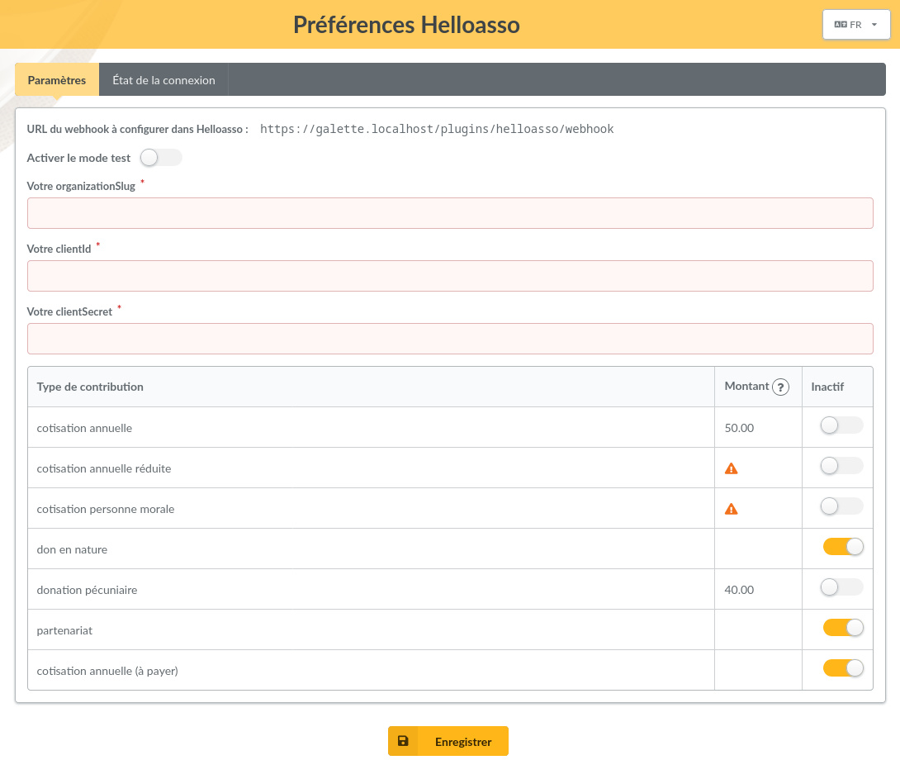

Ce plugin offre :

* un formulaire de paiement en ligne,
* un historique des paiements,
* la création automatique de contributions une fois les paiements validés.

**Note** : ce plugin nécessite la **version 1.2.1 de Galette minimum**.


**Important** : Pour fonctionner, ce plugin nécessite que votre instance de Galette soit accessible publiquement et servie avec un certificat SSL valide.

## Installation

Tout d’abord, téléchargez le plugin :

[](https://github.com/galette-community/plugin-helloasso/releases/tag/1.0.0-rc1)

Décompressez l'archive téléchargée dans le répertoire `plugins` de Galette. Par exemple, sous linux (en remplaçant *{url}* et *{version}* par les valeurs correspondantes):

```
$ cd /var/www/html/galette/plugins
$ wget {url}
$ tar xjvf galette-plugin-helloasso-{version}.tar.bz2
```

## Initialisation de la base de données

Pour fonctionner, ce plugin nécessite plusieurs tables dans la base de données. Voir [l'interface de gestion des plugins de Galette](https://doc.galette.eu/fr/master/plugins/#plugins-management-interface).

Et voilà, le plugin *HelloAsso* est installé. :)

## Utilisation du plugin

Une fois le plugin installé, un groupe *Helloasso* est ajouté au menu de Galette lorsqu'un utilisateur est connecté, permettant aux administrateurs et aux membres du personnel de définir les préférences du plugin et de consulter l'historique des paiements.


Le formulaire de paiement est accessible depuis les pages publiques de Galette. 

Seuls les utilisateurs *connectés* à leur compte peuvent payer des contributions *avec extension d'adhésion* (ou cotisations).


**Note** : Lorsqu'une contribution (cotisation ou don) est créée suite à un paiement par un utilisateur connecté, le type de paiement attribué à cette contribution dans la liste des contributions est *"Carte de crédit"*.

Les simples visiteurs (utilisateurs *non connectés* à leur compte) peuvent uniquement payer des contributions *sans extension d'adhésion* (ou dons). Et dans ce cas, aucune contribution n'est automatiquement créée dans Galette, le paiement figure seulement dans l'historique des paiements du plugin.


### Préférences



#### Paramètres

* **URL de callback à configurer dans Helloasso** : cette URL est à renseigner dans le champ *"Mon URL de callback"* dans la section "Intégrations et API" du compte de votre association sur HelloAsso.
* **Activer le mode test** : pour utiliser le mode test, vous devez au préalable vous créer un compte de test sur [helloasso-sandbox.com](https://www.helloasso-sandbox.com). Vous pourrez ainsi tester le fonctionnement du plugin sans effectuer de véritables paiements en ligne.
* **Votre organizationSlug** : vous trouverez cette information dans la barre d'URL de votre navigateur connecté au compte de votre association sur HelloAsso. Il s'agit de la première partie du chemin d'accès de l'URL de votre compte. Par exemple, dans l'URL `https://admin.helloasso.com/{organizationSlug}/accueil` il s'agit de *{organizationSlug}*
* **Votre clientId** : vous trouverez cette information dans le champ *"Mon clientID"* dans la section "Intégrations et API" du compte de votre association sur HelloAsso.
* **Votre clientSecret** : vous trouverez cette information dans le champ *"Mon clientSecret"* dans la section "Intégrations et API" du compte de votre association sur HelloAsso.


* **Types de contribution** : dans ce tableau vous pouvez désactiver les [types de contribution configurés dans Galette](https://doc.galette.eu/fr/master/usermanual/contributions.html#contributions-types) que vous ne souhaitez pas voir proposés comme motif de paiement sur le formulaire de paiement en ligne. 
  
  *Les types de contribution dont le montant est nul, ou dont le montant n'est pas configuré, ne seront pas proposés comme motifs de paiement sur le formulaire, même ci ceux-ci ne sont pas marqués comme inactifs dans le tableau.*

#### État de la connexion

Cet écran montre si le plugin est correctement paramétré et connecté à HelloAsso.


